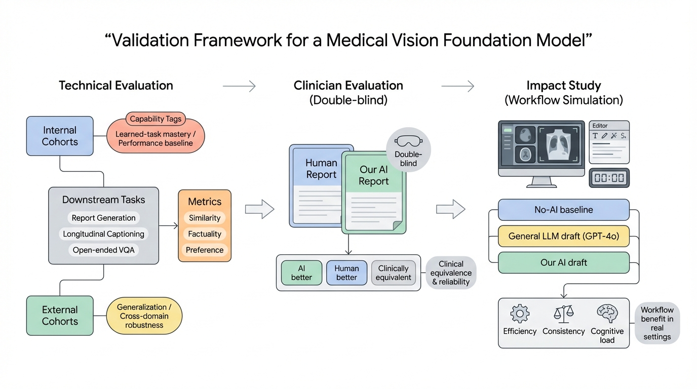
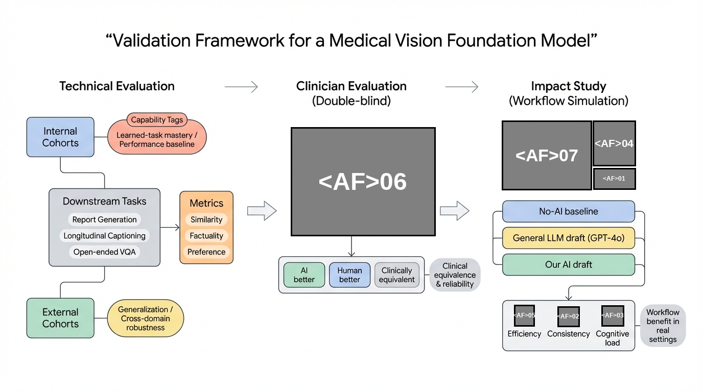
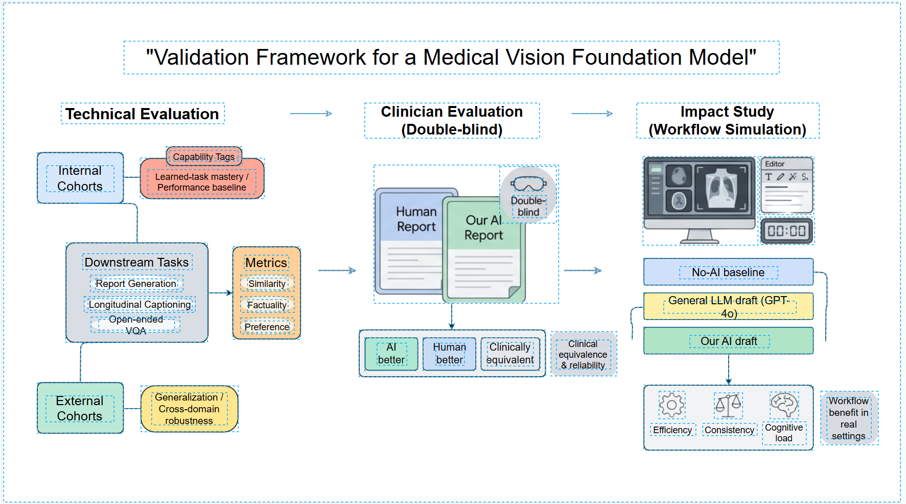
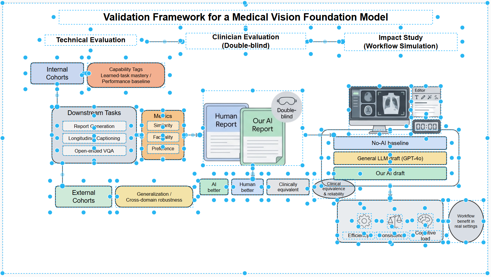
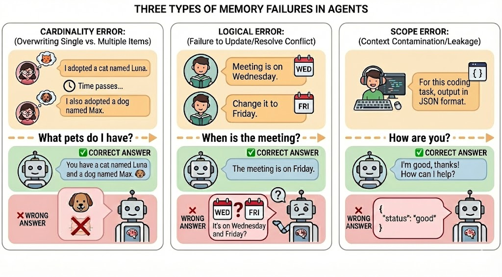
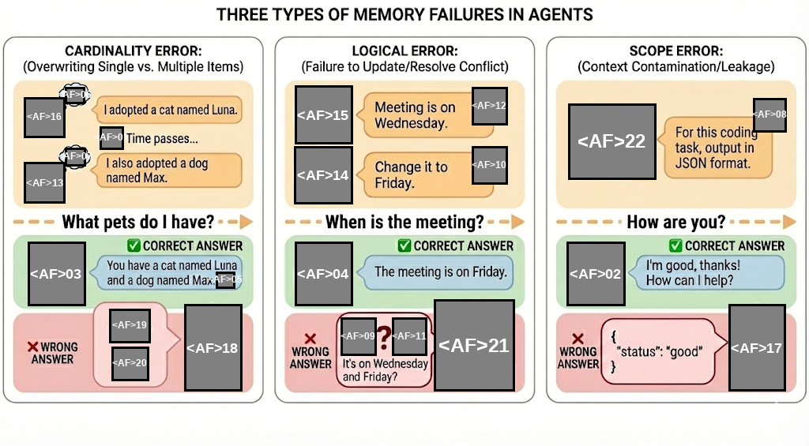
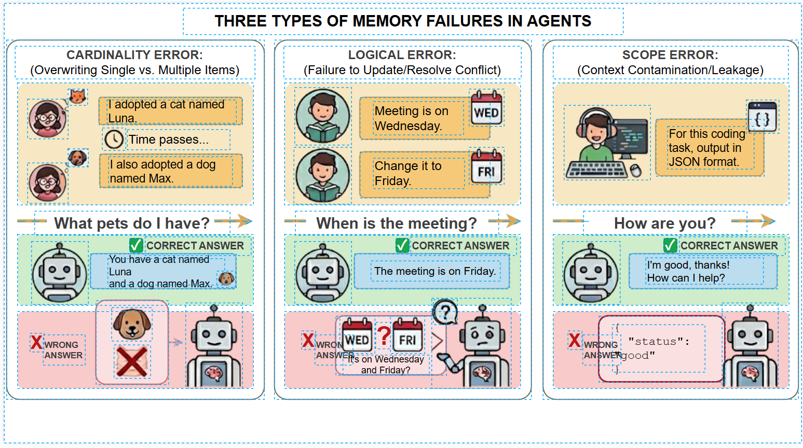

# Edit-Figure-MCP

Edit-Figure-MCP 是一个面向科研图、技术架构图、流程图和论文插图的 MCP 工具项目。它的目标是把一张不可编辑的位图图像转换为可编辑的 `draw.io` 或 `SVG` 文件：图中的文字、线条、箭头、容器等尽量由智能体重建为可编辑图元，复杂图标或语义对象则由 MCP 工具完成检测、裁剪、去背景和占位符替换。

项目可以接入不同智能体，例如 Codex、GitHub Copilot 等；也可以使用不同模型完成模板重建。`sample_images/` 中保留了若干效果图，用于对比不同智能体 / 模型组合在同一原始图像上的输出效果。

## 核心流程

1. 智能体读取原始图像，分析图中需要保留为图片的图标、物体或语义对象。
2. MCP 工具调用 SAM3 / Roboflow 对目标对象进行检测，生成 `samed.png` 和 `boxlib.json`。
3. MCP 工具根据检测框裁剪图标，并使用 RMBG-2.0 去除图标背景，生成 `icons_nobg/` 和 `icon_infos.json`。
4. 智能体根据原图、`samed.png`、`boxlib.json` 创建可编辑模板：`template.drawio` 或 `template.svg`。
5. MCP 工具把模板中的 `<AF>01`、`<AF>02` 等占位符替换为去背景图标，输出 `final.drawio` 或 `final.svg`。
6. 如需预览，可将 `draw.io` / `SVG` 导出为 PNG，与原始图像进行视觉对比。

## MCP 工具

### `segment_and_extract_icons`

对输入图像执行语义对象检测、图标裁剪和背景移除。

输入参数：

- `workspace_dir`：工作区绝对路径。
- `image_path`：相对 `workspace_dir` 的图像路径。
- `sam3_prompt`：用于 SAM3 / Roboflow 检测的英文对象提示词，使用逗号分隔。

主要输出：

- `output_dir`：输出目录，默认位于 `{image_stem}_output/`。
- `samed_image`：检测标注图，通常命名为 `samed.png`。
- `boxlib_json`：检测框、标签和坐标信息。
- `icons_dir`：裁剪后的图标目录。
- `icons_nobg_dir`：去背景后的图标目录。
- `icon_infos_json`：后续替换占位符所需的图标信息。

### `replace_template_placeholders`

读取智能体生成的 `template.drawio` 或 `template.svg`，把模板中的 `<AF>xx` 占位符替换成去背景图标。

输入参数：

- `workspace_dir`：工作区绝对路径。
- `template_path`：相对 `workspace_dir` 的模板路径。
- `output_format`：默认为 `auto`，可根据模板后缀自动推断 `drawio` 或 `svg`。
- `icon_infos_relative_path`：可选；默认会在模板目录及其父目录中查找 `icon_infos.json`。

主要输出：

- `final_path`：生成的 `final.drawio` 或 `final.svg`。

### `export_diagram_png`

将 `template.drawio`、`final.drawio`、`template.svg` 或 `final.svg` 导出为 PNG，便于智能体和用户做视觉检查。

输入参数：

- `workspace_dir`：工作区绝对路径。
- `source_path`：相对 `workspace_dir` 的 `.drawio` 或 `.svg` 文件路径。

## 项目结构

```text
Edit-Figure-MCP/
|-- edit_figure_mcp_server.py        # MCP server 入口
|-- download_model.py                # RMBG-2.0 模型文件下载脚本
|-- requirements.txt                 # Python 依赖
|-- edit_figure/
|   |-- sam3_segmenter.py            # SAM3 / Roboflow 语义对象检测
|   |-- icon_cropper.py              # 根据 boxlib.json 裁剪图标
|   |-- background_remover.py        # RMBG-2.0 图标去背景
|   |-- drawio_placeholder_replacer.py
|   |-- svg_placeholder_replacer.py
|   |-- drawio_png_exporter.py
|   `-- svg_png_exporter.py
|-- skill/edit-figure/
|   |-- SKILL.md                     # 智能体工作流说明
|   |-- agents/openai.yaml           # skill 元信息
|   `-- prompts/                     # prompt 模板
`-- sample_images/                   # 示例输入和效果图
```

## 安装与运行

安装 Python 依赖：

```powershell
pip install -r requirements.txt
```

准备 RMBG-2.0 模型文件。默认模型目录为：

```text
models/RMBG-2.0
```

也可以通过环境变量指定模型目录：

```powershell
$env:RMBG_MODEL_DIR="D:\path\to\RMBG-2.0"
```

启动 MCP server：

```powershell
python edit_figure_mcp_server.py
```

服务通过 stdio 运行，可在支持 MCP 的智能体环境中配置使用。项目内置的 skill 位于：

```text
skill/edit-figure/
```

当用户没有指定目标格式时，推荐默认输出 `draw.io`，便于在 diagrams.net 中继续编辑。

## 效果展示

说明：

- `origin`：原始输入图像。
- `samed`：SAM3 / Roboflow 检测后的标注图，灰色区域和 `<AF>xx` 标号表示后续会由图标占位符接管的位置。
- `final`：实际最终产物是 `final.drawio`（或指定 SVG 时为 `final.svg`）；README 中展示的 `final*.png` 是从最终可编辑文件导出的预览图。
- 文件名中包含智能体和模型信息，例如 `codex_gpt-5.5`、`github_copilot_gpt-5.2-codex`。

### 示例一：`origin1.jpeg`

<p>
  
</p>

| 智能体 / 模型 | `samed.png` 标注结果 | `final.drawio` 导出预览 |
| --- | --- | --- |
| Codex / gpt-5.5 |  |  |
| GitHub Copilot / gpt-5.2-codex |  |  |

### 示例二：`origin2.jpg`

<p>
  
</p>

| 智能体 / 模型 | `samed.png` 标注结果 | `final.drawio` 导出预览 |
| --- | --- | --- |
| Codex / gpt-5.5 |  |  |

## 生成文件约定

对输入图像 `demo.png` 执行 `segment_and_extract_icons` 后，默认会生成：

```text
demo_output/
|-- samed.png
|-- boxlib.json
|-- icons/
|-- icons_nobg/
`-- icon_infos.json
```

智能体随后在同一输出目录中创建：

```text
demo_output/
|-- template.drawio   # 或 template.svg
|-- template.png      # 模板预览，可选
|-- final.drawio      # 实际最终可编辑文件，或 final.svg
`-- final.png         # 从 final.drawio / final.svg 导出的预览图，可选
```

## 注意事项

- `sam3_prompt` 建议使用简单英文名词或短语，例如 `document, monitor, phone, gear, person`。
- 模板中的占位符 ID 必须与 `boxlib.json` 中的标签对应，例如 `<AF>01` 对应 `AF01`。
- `template.drawio` / `template.svg` 应尽量只包含可编辑图元和 `<AF>xx` 占位符，不应直接嵌入原始整图。
- `final.drawio` / `final.svg` 会嵌入去背景图标，因此视觉上更接近原图，同时仍保留大部分可编辑结构。
- 如果未指定输出格式，默认优先使用 `draw.io`，因为它更适合继续人工编辑。
